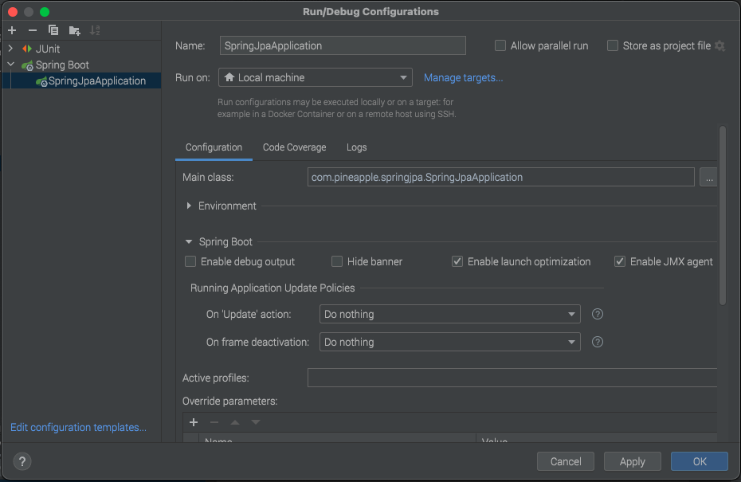

# spring-jpa

### Run locally

#### To run this project in minikube execute in commands in these order
#### Only for first time
* ```make minikube-create```
#### Then, to compile the jar
* ```make minikube-build-image```
#### Then, to deploy the jar
* ```make minikube-deploy```

#### To run this project by command in the main directory
* ```make run```

#### To run pitest coverage test
* ```make pitest```

#### after pitest, you could find html report of coverage in this directory
* ```./target/pit-reports/index.html```

#### To run test & pitest coverage test
* ```make test```

#### To format code
* ```make format```

### Configuration in IDEA locally

The image below is illustrative only and is an example with intelliJ.



### Configuration to run maven test with debugger

The image below is illustrative only and is an example with intelliJ.

